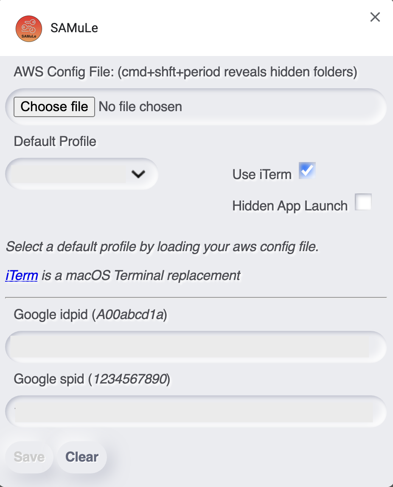
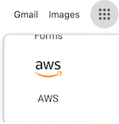
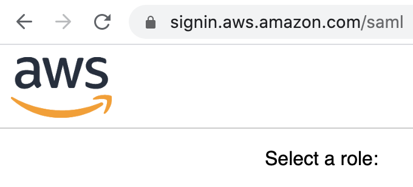
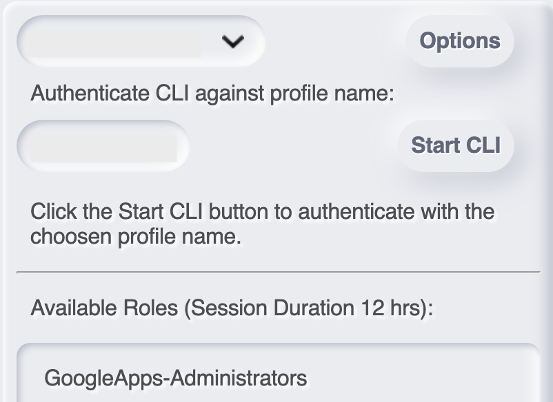

# chrome-extension-samule

## Introduction

Provides seamless single click AWS CLI authentication from Chrome using Google Federation SAML tokens in the background.

## Getting started

For the extension to work you need to install https://pypi.org/project/awscli-saml/

    pip install awscli-saml

Copy the SAMuLe helper app to Applications and double click it so that the URL helper is installed in macOS. SAMuLe invokes the helper app with samule:// from the Chrome browser address bar which in turn launches macOS terminal (default) or iTerm, so long as you have the latter selected in the options.

With the helper app set up; load the extension in Chrome and set up it's options.
Load your ~/.aws/config file so you can select the AWS profile you want to commence a CLI session with. Hold SHFT-CMD-FULLSTOP to reveal hidden files in Finder.



When you provide your Google idpid and spid the SAMuLe extention is able to fire up the AWS Federated access page in the background and grab the SAML token. See below for notes on getting this to work smoothly.

Now that the SAMuLe helper app is ready, you've loaded your ~/.aws/config profiles, and set your Google ids (optional), you're ready to start the CLI with a single click.

When you're signed into your Google account in Chrome, new blank tabs show the Google apps grid icon. Click it and you should see the AWS app. Clicking this launches https://signin.aws.amazon.com/saml via the Google authentication page.




When you click on the SAMuLe extension you'll see a list of available accounts you can federate into with this token. So long as you have a profile selected, you can click on the start CLI button. Doing so copies the token to the clipboard, launches the SAMuLe helper app in a new tab and launches the terminal with aws-saml.



⚠️ Tokens only last five minutes. SAMuLe will show when the token will expire. A refresh button becomes available, but this only works if you have a single Google account. See below for details.

## Multiple Google Accounts

The extension operates the smoothest when you are only ever signed into one Google account in Chrome. If you have multiple Google accounts, the experience isn't quite so smooth as you have to select a Google account before the AWS Federated access page is displayed.

The SAMuLe extension will work with multiple Google accounts. It's just best to navigate to the AWS Federated access page first.

## Single Google Account

When you've got a single Google account, you've got everything set up and working sweet, you can select the "Hide App Launch" option.
The Google token page and SAMuLe launch window will open and close automatically in the background.

⚠️ Unless you tell Chrome to always launch SAMuLe, you'll miss the prompt if the launch window is hidden and nothing will happen. To enable the dialog that prompts you to save you selection "Always open..." run the following command in Terminal and restart Chrome.

    defaults write com.google.Chrome ExternalProtocolDialogShowAlwaysOpenCheckbox -bool true

## Installation

Clone the repo:

```
git clone git@github.com:edrpls/chrome-extension-samule.git name-of-your-project
```
